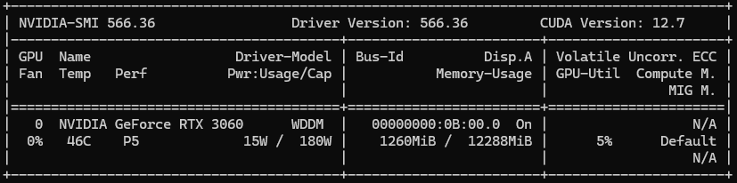
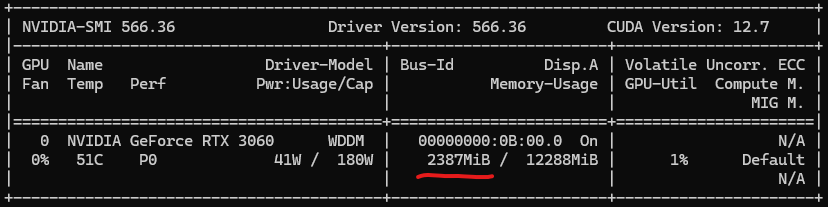
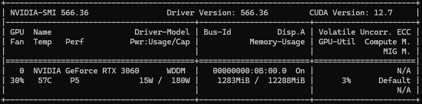
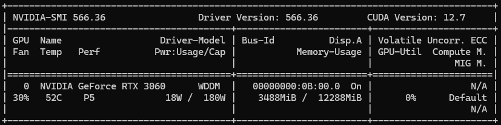
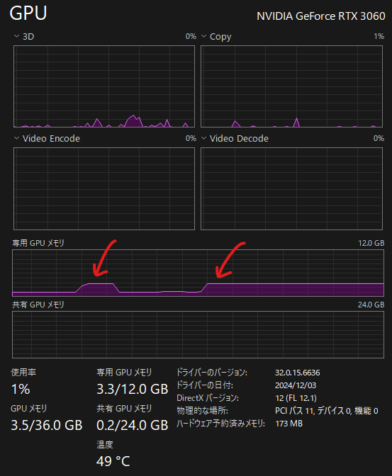
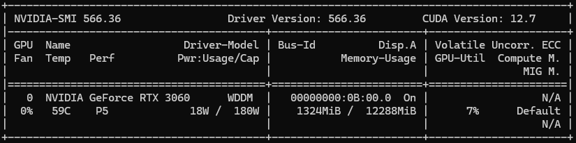
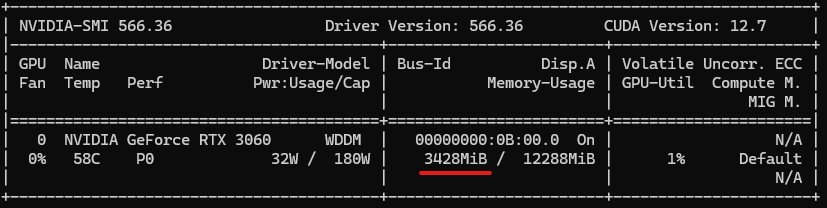

## Introduction

This post presents a hands-on comparison of three CUDA memory allocation methods and their memory usage behavior as observed via `nvidia-smi`.

I allocate **1GB** using each method and confirm:
- Whether the memory is truly allocated on the GPU.
- How `nvidia-smi` responds.
- Whether the device and host pointers are shared in the zero-copy setup.

---

## Environment

- **CUDA Toolkit**: 12.6  
- **OS**: Windows 11  
- **GPU**: NVIDIA RTX 3060  
- **Compiler**: `nvcc` + MSVC via VSCode  
- **Utilities**: `nvidia-smi` (monitoring), `std::cin.get()` (pause after allocation)

---

## Methods

Each memory allocation is done with a separate function, and we wait for key input after allocation to observe GPU memory usage in real time.

### 1. Device Memory with `cudaMalloc`

This allocates 1GB directly on the GPU (global memory).

```cpp
void* use_cudaMalloc() {
    void* device_ptr = nullptr;   
    if (isSuccess(cudaMalloc(&device_ptr, SIZE)))
    {
        std::cout << "cudaMalloc succeeded. Pointer = " << device_ptr << std::endl;
        return device_ptr;
    }
    return nullptr;
}
```

#### `nvidia-smi` Before and After



---

### 2. Unified Memory with `cudaMallocManaged`

This allocates managed memory shared between CPU and GPU. It also appears as ~1GB in `nvidia-smi` after access.

```cpp
void* use_cudaMallocManaged() {
    void* unified_ptr = nullptr;   
    if (isSuccess(cudaMallocManaged(&unified_ptr, SIZE)))
    {
        std::cout << "cudaMallocManaged succeeded. Pointer = " << unified_ptr << std::endl;
        return unified_ptr;
    }
    return nullptr;
}
```

#### `nvidia-smi` Before and After



---

The usage of VRAM can be seen on Windows Task Manager.


---

### 3. Pinned Host Memory with `cudaHostAlloc`

This allocates page-locked memory on the CPU side. `nvidia-smi` does **not** show any GPU memory usage.

```cpp
void* use_cudaHostAlloc() {
    void* host_ptr = nullptr;
    if(isSuccess(cudaHostAlloc(&host_ptr, SIZE, cudaHostAllocDefault)))
    {
        std::cout << "cudaHostAlloc succeeded. Pointer = " << host_ptr << std::endl;
        return host_ptr;
    }
    return nullptr;
}
```

#### `nvidia-smi` Before and After

The result of `nvidia-smi` is similar to the result in example 2. 




---

### 4. Zero-Copy Mapping with `cudaHostAllocMapped`

This allocates host memory accessible by the GPU, and we confirm that host and device pointers are identical.

```cpp
void* use_cudaHostAlloc_cudaHostAllocMapped()
{
    void* h_ptr = nullptr;
    if(isSuccess(cudaHostAlloc(&h_ptr, SIZE, cudaHostAllocMapped)))
    {
        void* d_ptr = nullptr;
        if(isSuccess(cudaHostGetDevicePointer(&d_ptr, h_ptr, 0))) // flag must be zero for now
        {
            std::cout << "Zero-copy mapping succeeded. Host = " << h_ptr << ", Device =" << d_ptr << std::endl;
            return h_ptr;
        }
        cudaFree(h_ptr);
        return nullptr;
    }
    return nullptr;
}
```

#### Output

```
cudaMalloc succeeded. Pointer = 0000000F06000000
cudaMallocManaged succeeded. Pointer = 0000001300000000
cudaHostAlloc succeeded. Pointer = 0000000204C00000
Zero-copy mapping succeeded. Host = 0000000244C00000, Device =0000000244C00000
```

Pointers are the same due to unified virtual addressing + zero-copy mapping.

---

## Output Comparison Summary

| Method               | VRAM Visible via `nvidia-smi` | Host Visible | Device Visible |
|----------------------|-------------------------------|---------------|----------------|
| `cudaMalloc`         | ✅ Yes (~1GB)                 | ❌            | ✅             |
| `cudaMallocManaged`  | ✅ Yes (~1GB)                 | ✅            | ✅             |
| `cudaHostAlloc`      | ❌ No                         | ✅            | ❌ (unless copied) |
| `cudaHostAllocMapped`| ❌ (but device-accessible)    | ✅            | ✅             |

---

## Conclusion

This experiment helped me understand how CUDA memory allocation mechanisms differ in both behavior and observability. Using `std::cin.get()` to pause execution allowed real-time monitoring with `nvidia-smi`.

I'll continue to explore memory behavior and optimization in future posts!

---

## What I Learned
- CUDA Memory Features:
  - **`cudaMallocManaged`**: Allocates memory that can be accessed from both CPU and GPU.
  - **`cudaHostAlloc`**: Allocates pinned host memory that can be accessed by the GPU.
  - **`cudaHostAllocMapped`**: An option for `cudaHostAlloc` that enables the host pointer to be mapped into the device address space.
  - **Unified Virtual Addressing (UVA)**: Provides a unified address space for both CPU (DRAM) and GPU (VRAM), allowing them to share pointer values.
  - **Unified Memory (UVM)**: Enables the CPU and GPU to access the same memory, with data automatically migrated between them as needed.

---

Thanks for reading!

👉 [GitHub Repo (cuda-examples)](https://github.com/yaikeda/cuda-examples/)
