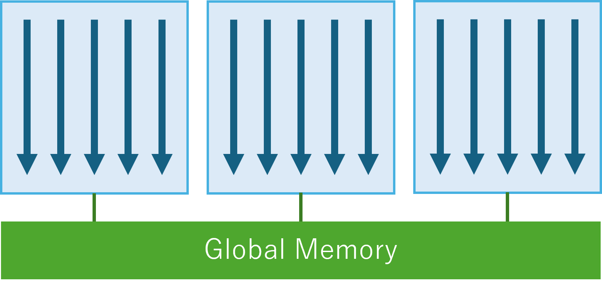
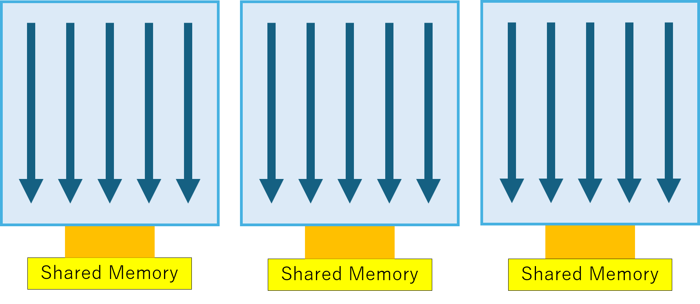
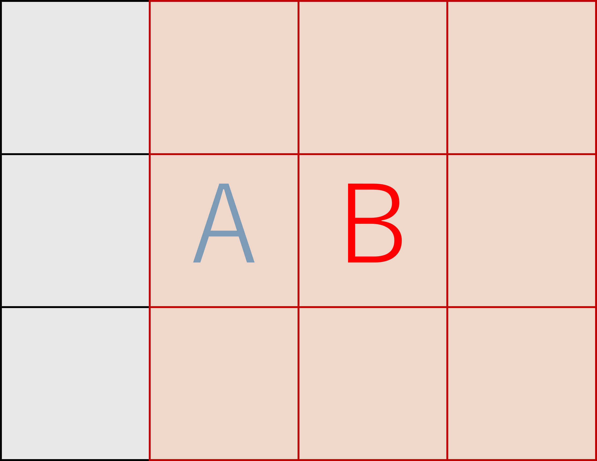

# Table of Contents

- [Differences Between Shared and Global Memory](#differences-between-shared-and-global-memory)
- [Typical Use Cases](#typical-use-cases)
- [Comparison Methodology](#comparison-methodology)
- [The Program](#the-program)
- [Environment](#environment)
- [Results](#results)
- [Findings](#findings)
- [When Things Go Wrong](#when-things-go-wrong)
- [Insights](#insights)
- [Conclusion](#conclusion)

---

In this article, we’ll first introduce two types of CUDA memory with different roles.
Then, we’ll write a comparison program and measure the speed difference.
Note that the experiment failed once—so we'll also discuss what went wrong.

## Differences Between Shared and Global Memory

CUDA provides multiple memory hierarchies. Among them, **shared memory** is a fast, local memory that threads within a block can share, while **global memory** is accessible by all threads.

- **Shared Memory**: Low latency, reset for each kernel execution, limited size.
- **Global Memory**: High latency, large capacity, accessible across the entire GPU.

Here’s a visual illustration of each memory type:

<div class="image-row">
    
    
</div>

## Typical Use Cases

Shared memory is suited for algorithms that require repeated access to local data.
It can significantly speed up performance in these scenarios:

- Filtering and convolution: For tasks like image blurring or edge detection.
- Sorting (within a block): Intermediate data can be shared efficiently among threads.

This is especially useful in **computer vision**, where shared memory helps with image filtering operations.

## Comparison Methodology

Shared memory is used to speed up access to nearby data. In computer vision, filtering is a common use case.

For example, when applying a blur to an image, the value of a pixel is determined based on the surrounding pixels.
Although many filtering methods exist, most rely on referencing nearby values and applying a computation to derive a new value.


Let’s consider a simple diagram. Suppose we are filtering the image shown above.


To calculate the value of A using a 3x3 filter, the range of pixels referenced looks like this.


To calculate B, we use this range.


As you can see, neighboring pixels share part of their reference area (in green).

In such cases, multiple threads may access overlapping data repeatedly.
While each access takes only a tiny amount of time, this cost scales with image size and filter size.

For example, a 4K image has 3,840x2,160 = 8,294,400 pixels.
Even the slightest delay per access can significantly impact total computation time.

This experiment compares execution time between using shared memory and using only global memory.

## The Program

The code used in this experiment is available here:
[GitHub](https://github.com/yaikeda/cuda-examples/blob/main/samples/007_sharedMemory/sharedMemory.cu)

Implemented in C++ and CUDA C++, the program does the following:
- Generates pseudo-random image data (float arrays)
- Allocates CUDA memory (global)
- Launches CUDA kernels
- Allocates shared memory inside the kernel
- Measures execution time (repeated runs to ensure stable measurement)

## Environment

| Component | Value |
|----------|--------|
| CPU | AMD Ryzen 3700X |
| GPU | NVIDIA RTX 3060 |
| CUDA Toolkit | 12.9 |
| NVIDIA Driver | 576.02 |
| OS | Windows 11 |
| Compiler | cl.exe (MSVC) |

## Results

The following are the total execution times over 1,000 runs:
These results are measured after warm-up runs to eliminate any global memory slowdown on first use.

```
Filter = 3x3
[global] REPEAT 1000 FILTER 3 Time : 72.1703 ms
[Shared] REPEAT 1000 FILTER 3 Time : 27.0231 ms
```
*Using shared memory resulted in a **2–3x speedup**.*

```
Filter = 5x5
[global] REPEAT 1000 FILTER 5 Time : 170.285 ms
[Shared] REPEAT 1000 FILTER 5 Time : 37.7198 ms
```

```
Filter = 7x7
[global] REPEAT 1000 FILTER 7 Time : 291.37 ms
[Shared] REPEAT 1000 FILTER 7 Time : 53.5055 ms
```
*As the filter size increases, the performance gap becomes more noticeable.*

## Findings

- Shared memory caching was effective for neighbor access.
- Redundant memory access per thread was reduced.
- Larger filters amplified the performance difference.

## When Things Go Wrong

Certain implementations may actually run **slower**:

- Copying too much unnecessary data into shared memory.
- Each thread still accessing the same global memory repeatedly.
- Excessive synchronization among threads.

For example, copying 9 pixels per thread does not reduce global memory access,
and the extra copy cost **slows down the kernel**.

In the initial version of this experiment, shared memory was misused.
Each thread accessed global memory 9 times, so the performance did not improve.

In the fixed version, each thread copies only one pixel, achieving fully parallel copying.

## Insights

- Leverage thread parallelism when copying to shared memory.
- Avoid redundant global memory access.
- Be mindful of `__syncthreads()` placement.

## Conclusion

- Shared memory is a high-speed temporary memory, reset on each kernel launch.
- It’s effective when multiple threads access the same data.
- Misusing it can hurt performance instead of helping.
- Designing proper memory access patterns is critical.

---

## Reference
- [NVIDIA CUDA C Programming Guide](https://docs.nvidia.com/cuda/cuda-c-programming-guide/index.html)

---

Thanks for reading!  
👉 [GitHub Repo (cuda-examples)](https://github.com/yaikeda/cuda-examples/)
