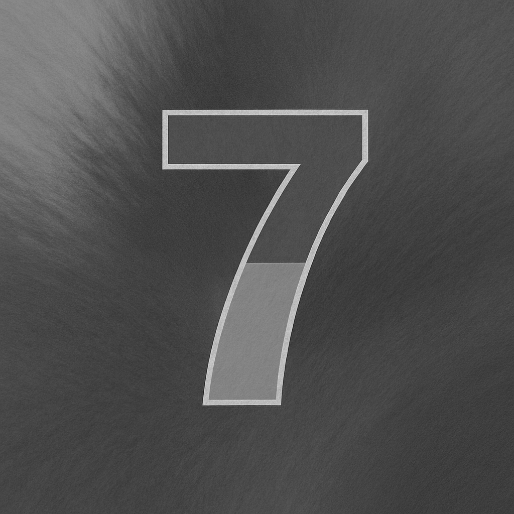
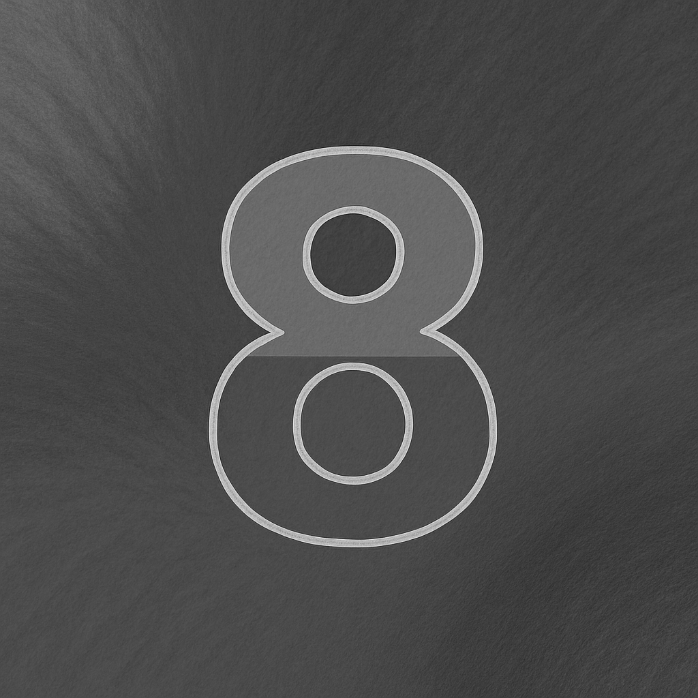

---
title: "[Debugging] Image Loading and CUDA Processing with Nsight Profiling and OpenCV"
date: 2025-05-21T21:00:00+09:00
draft: false
tags: ["CUDA", "Memory", "VRAM", "Nsight", "OpenCV"]
categories: ["Programming", "GPU", "Memory"]
summary: "This post investigates and resolves a bug encountered while transferring 2D image data to device memory and processing it with CUDA kernels."
---

## Table of Contents
- Purpose
- Refactoring Key Functions
- Investigation
- Root Cause Analysis
- [Aside] Truth Be Told
- Key Learnings

## Purpose
Today’s post is modest but focused: debugging.  
In yesterday’s post, I created a workflow that loaded an arbitrary number of images, processed them with CUDA kernels, and transferred the results back to CPU memory. I also verified the GPU-side behavior using Nsight.  
However, the output looked strange—although the images appeared grayscale, there were clear artifacts.  
This article walks through how I investigated and fixed the problem.

## Refactoring Key Functions
Before diving in, I rewrote yesterday’s code manually instead of copy-pasting it.  
Since I’m still learning CUDA, I find value in rewriting by hand: it helps me catch typos, reinforce the function logic, and internalize naming conventions.  
However, rewriting utility functions each time can be tedious. So I decided to extract some code into a reusable file.  
I created a file called **utils/utils.hpp** and moved the utility functions there, specifically `ImageStocker` and `ZeroPadding` from the previous program.

```cpp
// Zero fill function
std::string ZeroPadding(int digits, int num)
{
    std::ostringstream oss;
    oss << std::setw(digits) << std::setfill('0') << num;
    return oss.str();
}

// Small Image Load and Stock class
class ImageStocker
{
public:
    ImageStocker(std::string dir, int count)
    {
        for (int i = 1; i <= count; i++)
        {
            std::string imgPath = dir + "/img_" + ZeroPadding(2, i) + ".png";
            std::cout << "Image Path: " << imgPath << std::endl;
            cv::Mat img = cv::imread(imgPath);
            if (img.empty()) {
                printf("failed to load image\n");
                break;
            }
            m_images.push_back(img);
        }
    } 
    int NumImages()
    {
        return m_images.size();
    }
    cv::Mat Get(int id)
    {
        if (NumImages() <= id)
        {
            std::cout << "m_images.size() <= id" << std::endl;
            return cv::Mat();
        }
        return m_images[id];
    }

private: 
    std::vector<cv::Mat> m_images;
};
```

Including this header keeps the `.cu` file more focused on its core logic.

## Investigation
Let’s begin the investigation.  
Before diving into code, I tried to form a hypothesis based on the output.  
Let’s revisit one of the “broken” images from yesterday’s run. It has some notable characteristics:

<div class="image-row">
  
</div>

- The image structure is intact  
- All pixels are rendered  
- It appears grayscale  

### The structure is intact  
We can still recognize the number displayed at the center of the image, meaning the layout isn't corrupted.  
This ruled out common byte-level errors, such as stride misalignment or incorrect bit-depth assumptions (e.g., 24-bit vs. 32-bit).  
In such cases, you might expect segmentation faults or visually shifted pixels.  
Here, the image contents imply that memory allocation, referencing, and writing are all working as expected.

### All pixels are rendered  
If there were transfer errors or processing stopped mid-way, you might see blank or partial images.  
In this case, though, every pixel seems touched—so it’s likely not a partial failure.

### It appears grayscale  
A total failure would produce solid black or white images.  
This one clearly has color variation.

Putting this together, we can assume that memory allocation, host-device transfers, reconstruction via `cv::Mat`, and image saving were all correct.  
So the root cause likely lies in how the color conversion was computed.

## Root Cause Analysis
Looking back at the CUDA kernel, the bug was quickly spotted:  
The formula to calculate grayscale used multiplication instead of addition.

```cpp
__global__ void grayscaleKernel(cudaTextureObject_t texObj, unsigned char* out, int width, int height)
{
    int x = blockIdx.x * blockDim.x + threadIdx.x;
    int y = blockIdx.y * blockDim.y + threadIdx.y;
    if (x >= width || y >= height) return;

    uchar4 pixel = tex2D<uchar4>(texObj, x, y);
    unsigned char gray = (pixel.x * pixel.y + pixel.z) / 3; // Bug here!
    out[y * width + x] = gray;
}
```

This should have been:

```cpp
unsigned char gray = (pixel.x + pixel.y + pixel.z) / 3;
```

After fixing this line, the output images were correctly converted to grayscale!

<div class="image-row">
    
    
    
    
    
</div>
<div class="image-row">
    
    
    
    
    
</div>


## [Aside] Truth Be Told
Interestingly, I actually caught this bug early—before running any tests.  
Because I was rewriting the code manually (part of my learning process), I noticed the multiplication almost immediately.  
When in doubt, I recommend rewriting a small program by hand.  
If you can’t write it without understanding it, you don’t fully know it—just like with any language.

## Key Learnings
- CUDA kernels ran correctly—but logic errors can still ruin results.
- Handling 2D textures in CUDA involves special memory structures and setup.
- Once mastered, texture objects enable fast and cache-efficient image access.
- Debugging manually can uncover mistakes even before you hit “Run.”

---

Thanks for reading!  
👉 [GitHub Repo (cuda-examples)](https://github.com/yaikeda/cuda-examples/)
