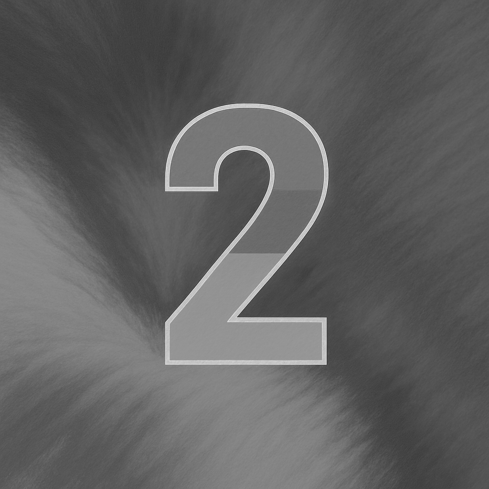
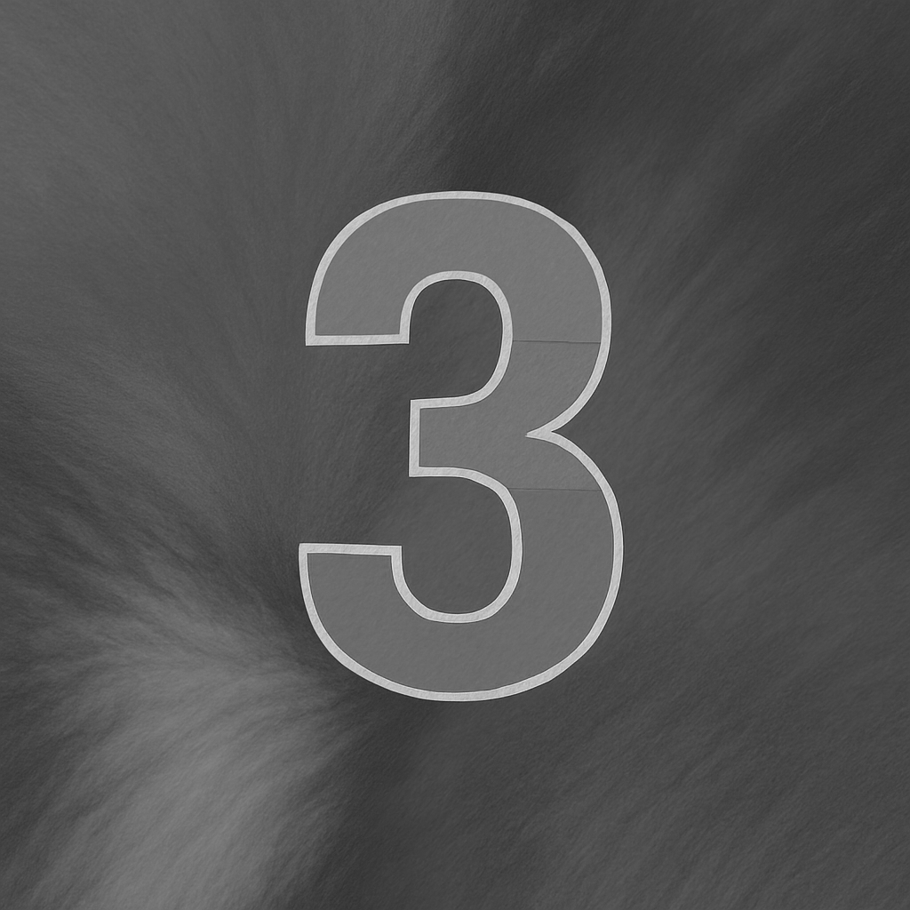
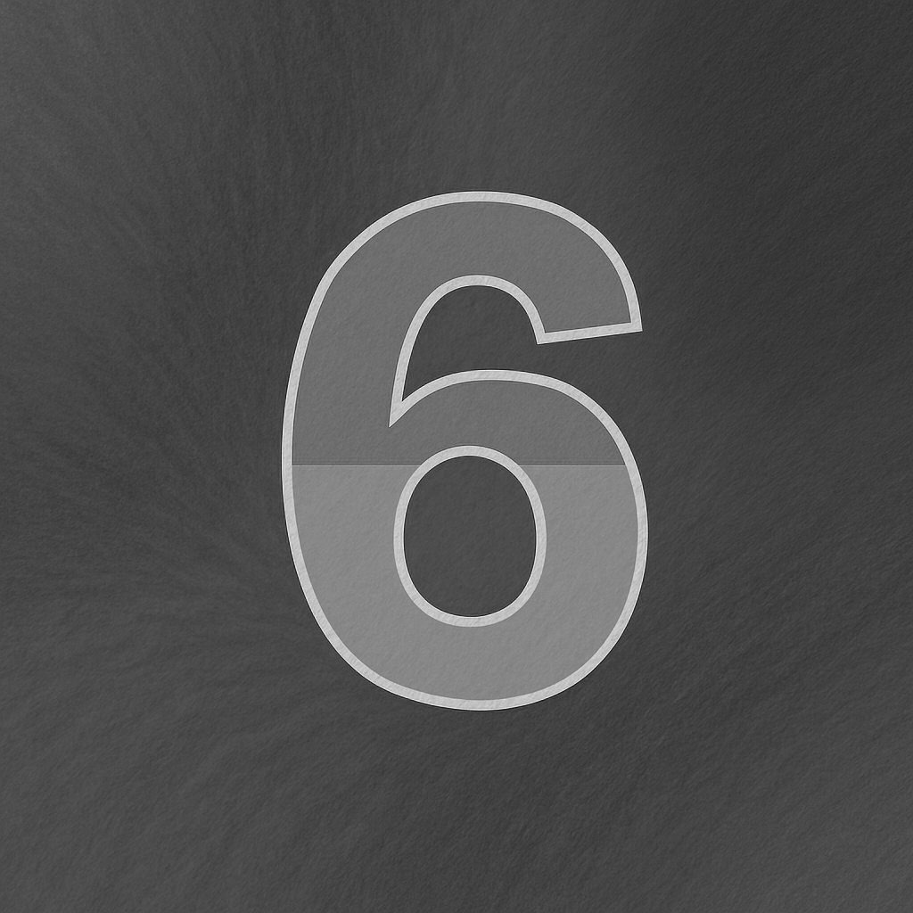
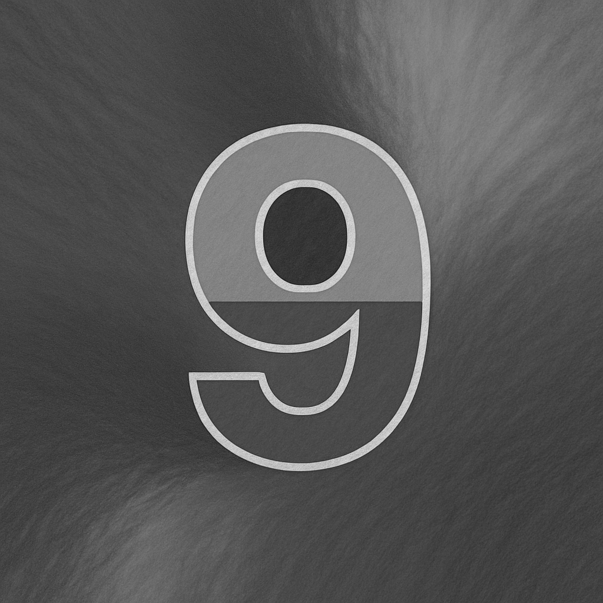

## Table of Contents
- 目的
- 必要な関数の切り出し
- 調査
- 原因の特定
- [余談] 実のところ
- Key Learnings

## 目的
本日の記事の目的は、地味ですがデバッグです。
[昨日の記事](posts/cuda-imageLoadProcess/index.md)では、arbitral number of imagesをロードし、カーネルで処理し、CPUメモリに書き戻す処理をしました。また、この処理をNsightを用いて確認することができました。
しかし、結果がおかしく、画像がグレースケールにはなっていましたが、アーティファクトがありました。
今日はこの問題の原因を探索し、修正する記事となります。

## 必要な関数の切り出し
その前に、昨日のプログラムをコピーペーストではなく手動で書き写します。
現在、私はCUDAの学習中なので、手で書き写しています。
手で書き写すことには意味があり、タイポを直したり、同じ関数を何度も参照することで使い方を覚えたり、関数の名前を強く指揮したりする効果があります。
しかし、ユーティリティ的な関数まですべて手で書き写すのは大変なので、今回は今後のために少しコードの切り出しを行います。
初めに **utils/utils.hpp** というファイルを作り、このファイルにユーティリティ関数を移動します。
昨日作った関数の中では、ImageStockerと、ZeroPaddingが該当するので、これを移動します。

```cpp
// Zero fill function
std::string ZeroPadding(int digits, int num)
{
    std::ostringstream oss;
    oss << std::setw(digits) << std::setfill('0') << num;
    return oss.str();
}

// Small Image Load and Stock class
class ImageStocker
{
    public:
        ImageStocker(std::string dir, int count)
        {
            for (int i = 1; i <= count; i++)
            {
                std::string imgPath = dir + "/img_" + ZeroPadding(2, i) + ".png";
                std::cout << "Image Path: " << imgPath << std::endl;
                cv::Mat img = cv::imread(imgPath);
                if (img.empty()) {
                    printf("failed to load image\n");
                    break;
                }
                m_images.push_back(img);
            }
        } 
        int NumImages()
        {
            return m_images.size();
        }
        cv::Mat Get(int id)
        {
            if (NumImages() <= id)
            {
                std::cout << "m_images.size() <= id" << std::endl;
                return cv::Mat();
            }
            return m_images[id];
        }
    private: 
        std::vector<cv::Mat> m_images;
};
```

これをインクルードすることで、cuファイルがより本質的な情報だけを持ったファイルになります。

## 調査
さて、それでは実際に調査を進めます。
まず、実際にコードを読んだり、手を動かしたりする前に予想を立てます。
昨日出力した**壊れた**画像を見てみましょう。重要な特徴を持っています。

<div class="image-row">
  
</div>

- 構造は壊れていない
- すべてのピクセルが描画されている
- 灰色ではある

### 構造は壊れていない
まず、構造は壊れていない、つまり中央に表示されている数字が読み取れることから、画像の構造は壊れていないことがわかります。
これは、画像をバイト配列化して処理するときによく起こる問題を疑っています。ストライドを間違えたり、画像のビット数を間違えて計算している（ex: 24bit vs 32bit）と、適切な画像参照ができません。
強制的に処理しようとして、セグメンテーションフォールトを起こしたり、画像が少しずつずれてしまったりします。
今回の結果では、中心にある数字が読めることから、メモリ配置、メモリ参照、メモリ書き込みは間違っていないことが予想されます。

### すべてのピクセルが描画されている
これも構造の話と似ています。コピーするビット数が不足していたり、処理が何らかの理由で途中までしか行われていないと、画像の半分が黒や白になったり、画像に欠損が出たりします。
しかし今回の画像では、画像はピクセルの値を持っているような動作をしており、配列のどこかで処理が失敗したのではなく、全体的に間違っていることがわかります。

### 灰色ではある
もし、処理に失敗していたり、そもそもカーネルが正しく動作しなかったりすると、値が0に初期化された状態では真っ黒になったり、真っ白になったりします。
しかし今回は、画面全体に色がついていました。

これらのことから考えると、Descriptionの定義、メモリの確保、データの転送（HtoD）、データの転送（DtoH）、メモリからcv::Matへの返還、画像化については門がなさそうなことがわかります。
あくまで、問題は色返還の処理の不具合であるという予想が立てられます。

## 原因の特定
ここまでの情報から、おそらくデバイスカーネルが怪しいと予測してコードを負いました。すると、重要な点に気づくことができます。
色の平均値を計算する箇所が、足し算であるべきところが掛け算になっています。

```
__global__ void grayscaleKernel(cudaTextureObject_t texObj, unsigned char* out, int width, int height) // New API can take texObj directly!!!
{
    // this is 2D then blockIdx also 2D.
    int x = blockIdx.x * blockDim.x + threadIdx.x;
    int y = blockIdx.y * blockDim.y + threadIdx.y;
    if (x >= width || y >= height) return;
    uchar4 pixel = tex2D<uchar4>(texObj, x, y);
    unsigned char gray = (pixel.x * pixel.y + pixel.z) / 3; // Here!!!!!
    out[y * width + x] = gray;
}
```

```
    unsigned char gray = (pixel.x * pixel.y + pixel.z) / 3;

                                  to

    unsigned char gray = (pixel.x + pixel.y + pixel.z) / 3;
```

これを修正すると、正しくグレースケールに変換されるようになりました！！

<div class="image-row">
    
    
    
    
    
</div>
<div class="image-row">
    
    
    
    
    
</div>

## [余談]実のところ
以上の手順で無事解決することができましたが、実はこのバグ、最初の時点で原因がわかっていました。

先ほど書いたように、私は学習のためこれくらいのプログラムであれば毎回手で書き写しています。
その中で、平均値を計算するべきところが明らかに掛け算をしていたので、早期に気づきました。
どうしてもバグが特定できないとき、コードの分量によっては自分の手でもう一度書き写してみることはお勧めです。
自分が理解して書かなければ書けないのは、言語の習得と同じなので。

## Key Learnings
- CUDAはカーネルの処理を正しく実行する
- 2DTextureを送るときには、CUDAの特殊なメモリ確保を使う、初期化が複雑になるなど難しい点もある。
- しかし、これにより高速なデータ処理が可能になるため、画像を多用する開発者は是非使うべき
