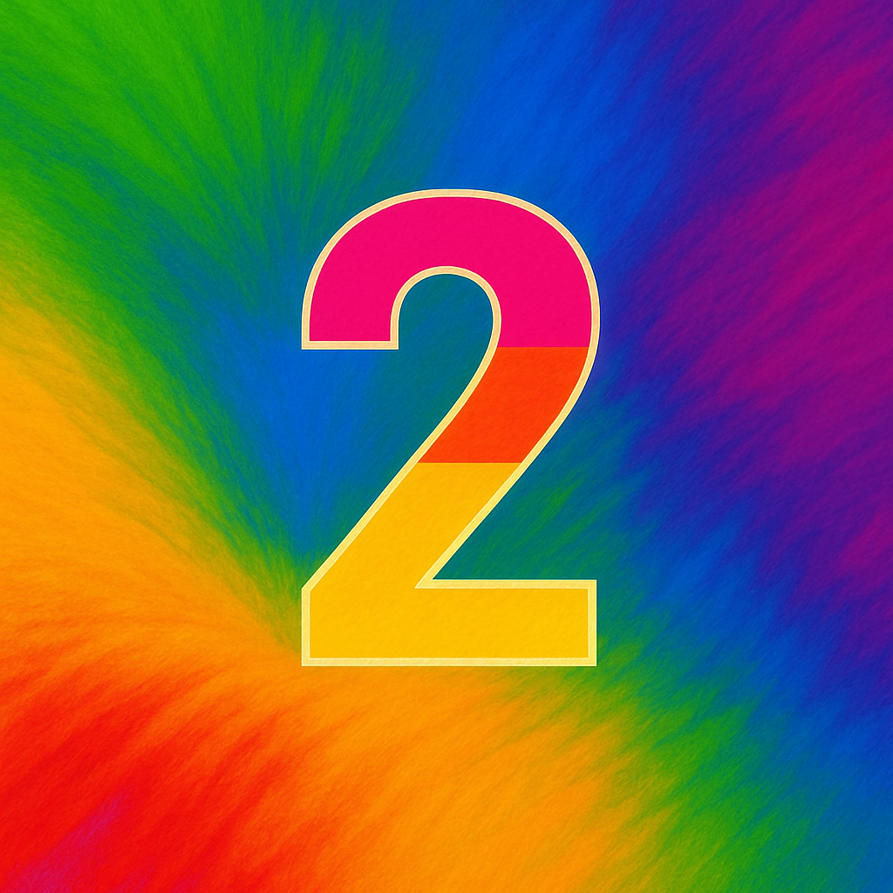

## Table of Contents
- Objective
- Installing Nsight
- Preparing Images
- Loading Images with OpenCV
- Data Transfer to CUDA Device
- Processing 2D Images
- Nsight Profiling Results
- Key Learnings

---

## Objective

The goal of this article is to demonstrate the complete workflow of loading images using C++, transferring them to a CUDA device, processing them with a CUDA kernel, and writing the results back to the CPU for saving.

<p style="align: center display: flex !important; gap: 10px;">
  
  
  <br>
  
  
  <br>
  <i>Our goal: Convert color images to grayscale using a CUDA kernel.</i>
</p>

---

## Installing Nsight

Standard debuggers cannot easily profile GPU-side operations. To address this, we use Nsight to visually verify if CUDA is working correctly.

If you have updated your NVIDIA driver recently, Nsight is likely already installed. Try typing "Nsight" in the Windows Start menu—if it shows “Nsight Systems,” it is ready to use.


---

## Preparing Images

You can use any image for this experiment. But since we now have access to AI tools, I asked ChatGPT to generate them. A couple of years ago, image generation AIs used latent space sampling based on encoded text. However, with the rise of Transformer models, the technology has evolved.

DALL·E 3 by ChatGPT uses a Transformer-based system and excels at rendering user instructions faithfully on screen. I requested "ten square images with vivid backgrounds and numbers in the center," and the result was as follows:

<p align="center">
  
  
  
  
  <br>
  
  
  
  
  <br>
  <i>Images generated using ChatGPT DALL·E 3.</i>
</p>

As a long-time user of Stable Diffusion, I was impressed by how consistently the images rendered readable numbers with balanced compositions. Although this detail isn’t directly related to the experiment, it’s worth noting the recent advances in image generation quality.

---

## Loading Images with OpenCV

Since the main goal is to transfer images to CUDA, I used OpenCV for loading and saving. You may find many tutorials suggesting a full source build of OpenCV, but that's unnecessary. The official site now offers user-friendly installers, similar to PyTorch’s.


After downloading and extracting the installer, add the appropriate include and lib paths to your build configuration. I used *Visual Studio Code* and added the following settings:

```
configure
"${workspaceFolder}/samples/thirdparty/opencv4-11-0/build/include",
"${workspaceFolder}/samples/thirdparty/opencv4-11-0/build/include/opencv2",

args
"-L", "${workspaceFolder}/samples/thirdparty/opencv4-11-0/build/x64/vc16/lib",
"-lopencv_world4110",
"-I", "${workspaceFolder}/samples/thirdparty/opencv4-11-0/build/include",
"-I", "${workspaceFolder}/samples/thirdparty/opencv4-11-0/build/include/opencv2"
```

I implemented a simple class to load and store multiple images from a directory, so that each test case can access them easily from a shared cache.

```
class ImageStocker
{
    public:
        ImageStocker(std::string dir, int count)
        {
            for (int i = 1; i <= count; i++)
            {
                std::string imgPath = dir + "/img_" + ZeroPadding(2, i) + ".png";
                std::cout << "Image Path: " << imgPath << std::endl;
                cv::Mat img = cv::imread(imgPath);
                if (img.empty()) {
                    printf("failed to load image\n");
                    break;
                }
                m_images.push_back(img);
            }
        } 
        int NumImages()
        {
            return m_images.size();
        }
        cv::Mat Get(int id)
        {
            if (NumImages() <= id)
            {
                std::cout << "m_images.size() <= id" << std::endl;
                return cv::Mat();
            }
            return m_images[id];
        }
    private: 
        std::vector<cv::Mat> m_images;
};
```
---

## Data Transfer to CUDA Device

Now, let’s get to the key section of this article.

We convert each `cv::Mat` image into a format suitable for the GPU and then transfer it. Initially, I assumed there would be an easy API like `cudaMemcpy`, but 2D image transfer requires additional image metadata like stride, width, height, and pixel format.

This is the minimal set of steps required to transfer a single image:

```cpp
// Set Image
cv::Mat imageBGRA;
cv::cvtColor(stocker.Get(i), imageBGRA, cv::COLOR_BGR2BGRA);
cudaChannelFormatDesc channelDesc = cudaCreateChannelDesc<uchar4>();
cudaArray* cuArray;
cudaMallocArray(&cuArray, &channelDesc, imageBGRA.cols, imageBGRA.rows);
cudaMemcpy2DToArray(cuArray, 0, 0,
    imageBGRA.ptr<uchar4>(), imageBGRA.step,
    imageBGRA.cols * sizeof(uchar4), imageBGRA.rows,
    cudaMemcpyHostToDevice);

// Texture Object
cudaResourceDesc resDesc = {};
resDesc.resType = cudaResourceTypeArray;
resDesc.res.array.array = cuArray;
cudaTextureDesc texDesc = {};
texDesc.addressMode[0] = cudaAddressModeClamp;
texDesc.addressMode[1] = cudaAddressModeClamp;
texDesc.filterMode = cudaFilterModePoint;
texDesc.readMode = cudaReadModeElementType;
texDesc.normalizedCoords = 0;

cudaTextureObject_t texObj = 0;
cudaCreateTextureObject(&texObj, &resDesc, &texDesc, nullptr);

// Allocate output
int width = imageBGRA.cols;
int height = imageBGRA.rows;
unsigned char* d_output;
cudaMalloc(&d_output, width * height * sizeof(unsigned char));

// Call kernel
dim3 block(16, 16);
dim3 grid((width + 15) / 16, (height + 15) / 16);
grayscaleKernel<<<grid, block>>>(texObj, d_output, width, height);

```

A notable detail is that newer APIs allow you to pass a cudaTextureObject_t directly as a kernel argument. Older methods required a global texture<> declaration, which was less readable and flexible.

---

## Processing 2D Images

Here is the kernel that converts the image to grayscale:

```
__global__ void grayscaleKernel(cudaTextureObject_t texObj, unsigned char* out, int width, int height)
{
    int x = blockIdx.x * blockDim.x + threadIdx.x;
    int y = blockIdx.y * blockDim.y + threadIdx.y;
    if (x >= width || y >= height) return;
    uchar4 pixel = tex2D<uchar4>(texObj, x, y);
    unsigned char gray = (pixel.x * pixel.y + pixel.z) / 3;
    out[y * width + x] = gray;
}
```

Unfortunately, the results were not as expected:

<p align="center">
  
  
  
  
  <br>
  
  
  
  
  <br>
  <i>Output images processed by the CUDA kernel.</i>
</p>

Something went wrong 🤔

The structure of the images seems preserved, but some colors are difficult to distinguish. This might be caused by an error in channel mapping (BGR/RGB) or memory layout mismatch. I’ll investigate further in a separate post.

---

## Nsight Profiling Results

Thanks to Nsight, we can now see exactly how each operation behaves.


We can zoom in and identify where HtoD (Host to Device), DtoH (Device to Host), and CUDA kernel calls occur, as well as which processes consume the most time.


CUDA malloc and kernel calls are executed sequentially for each image. In the next post, I will explore how the behavior changes when we pipeline the tasks using multiple streams.

## Key Learnings
- How to install and launch Nsight
- How to set up OpenCV quickly
- How to load images efficiently using OpenCV
- How to interface OpenCV Mat with CUDA device memory

---

Thanks for reading!  
👉 [GitHub Repo (cuda-examples)](https://github.com/yaikeda/cuda-examples/)
