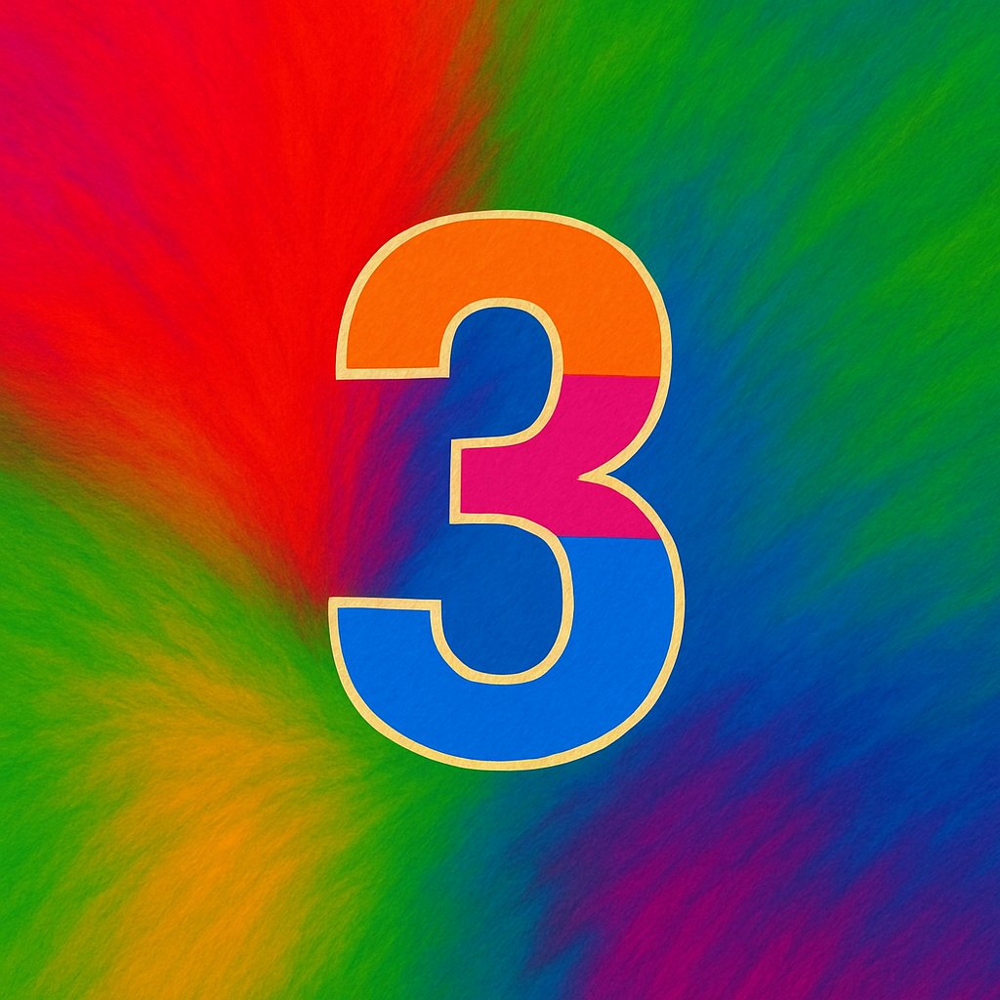
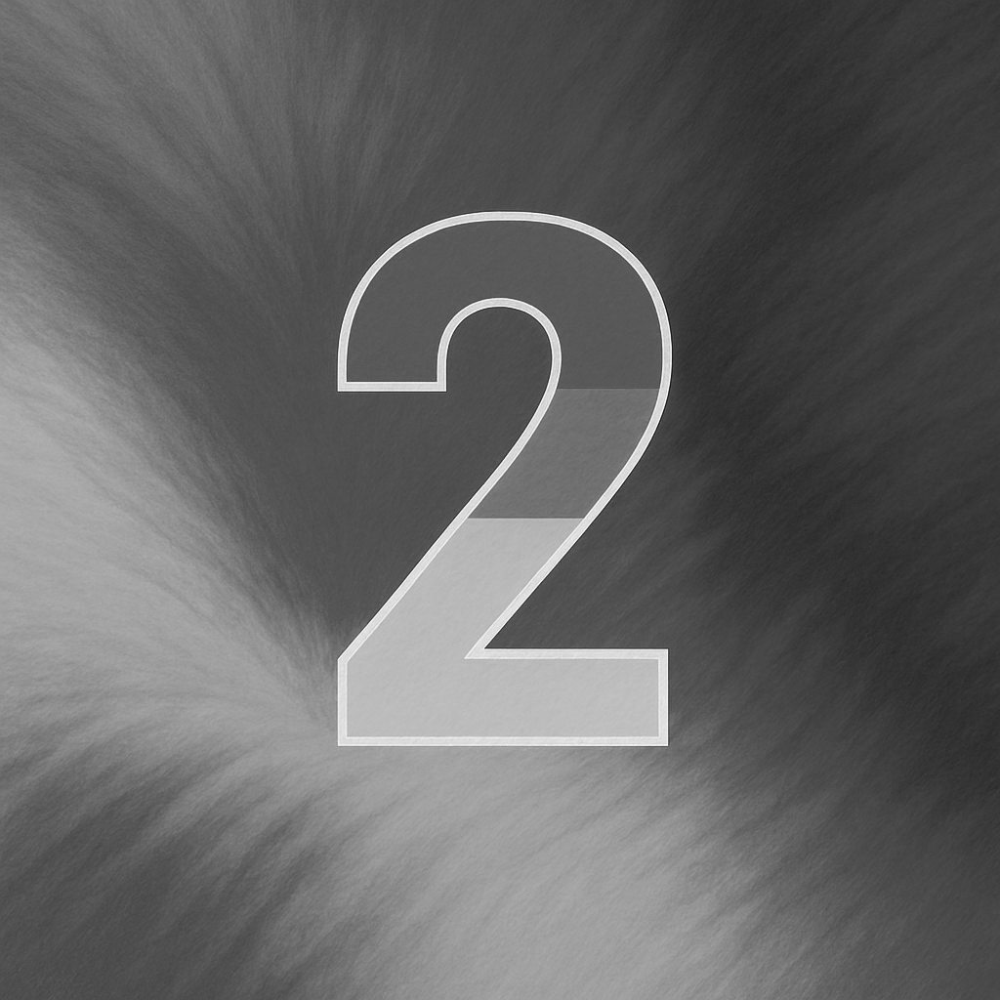
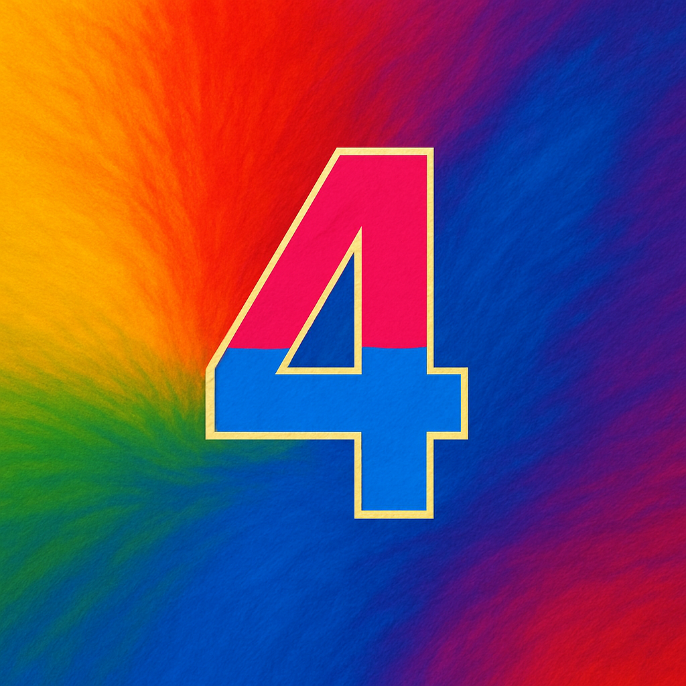
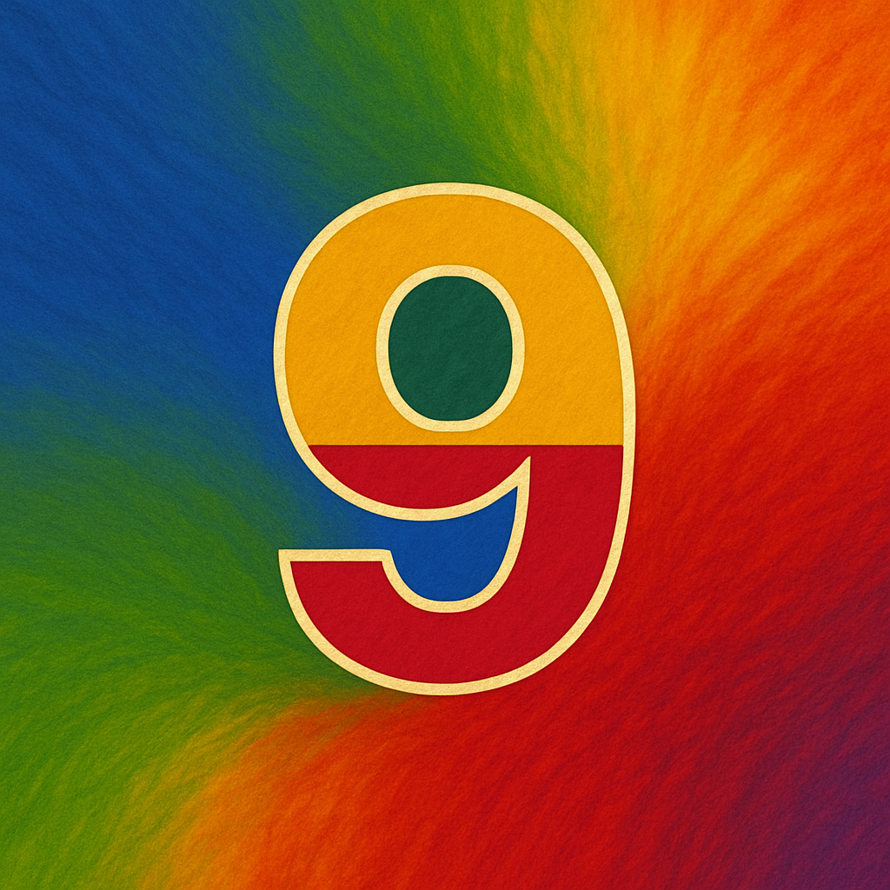
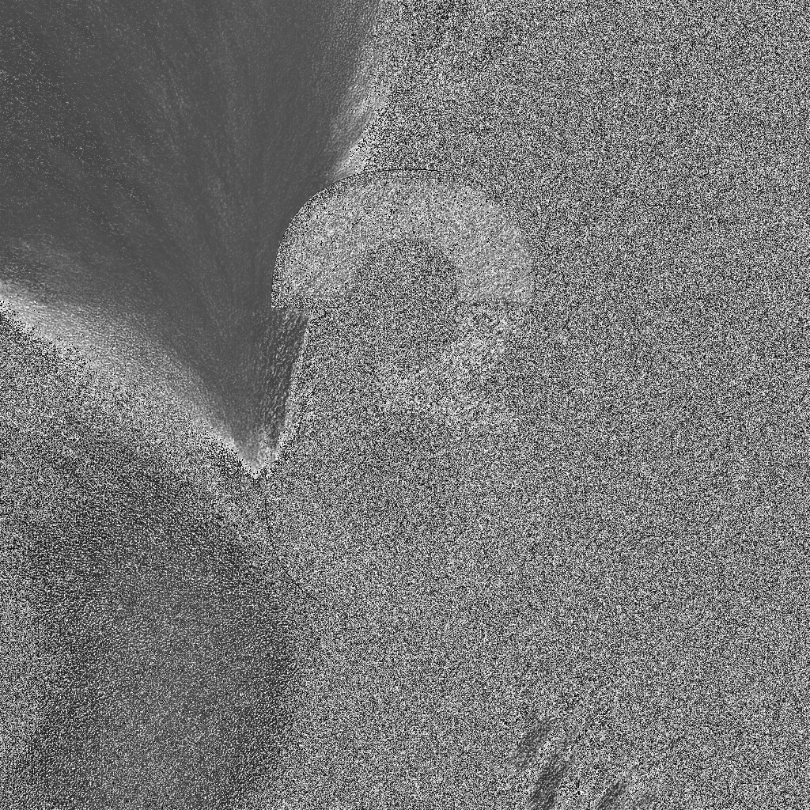
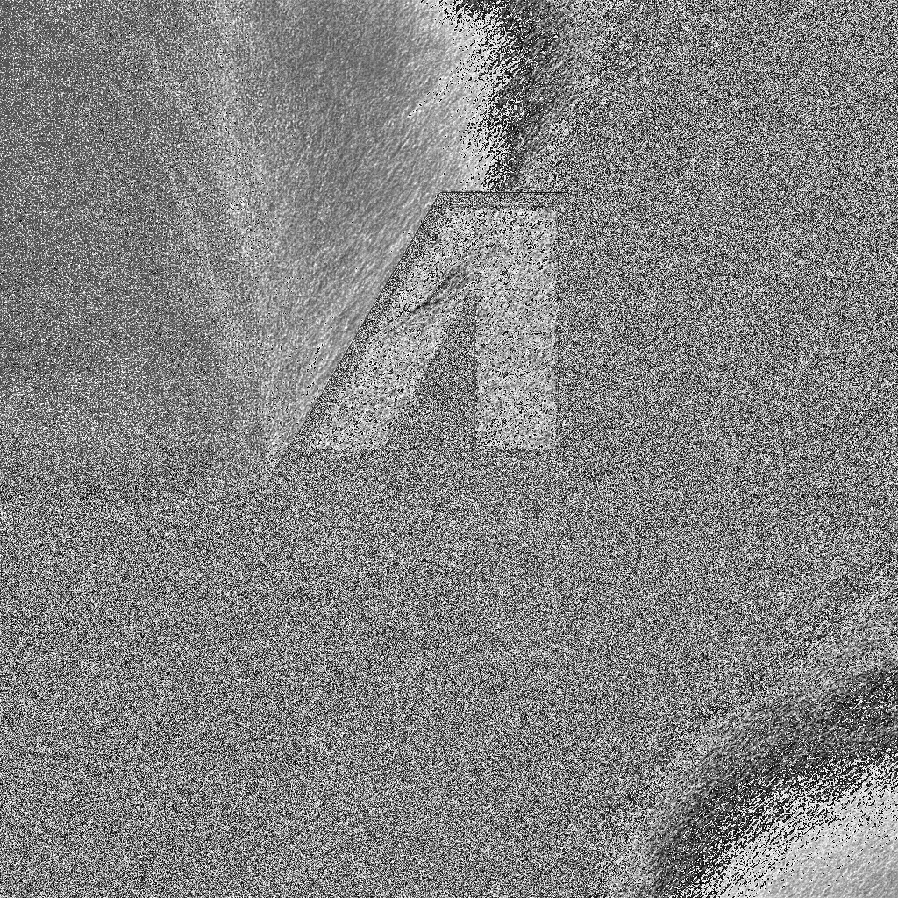
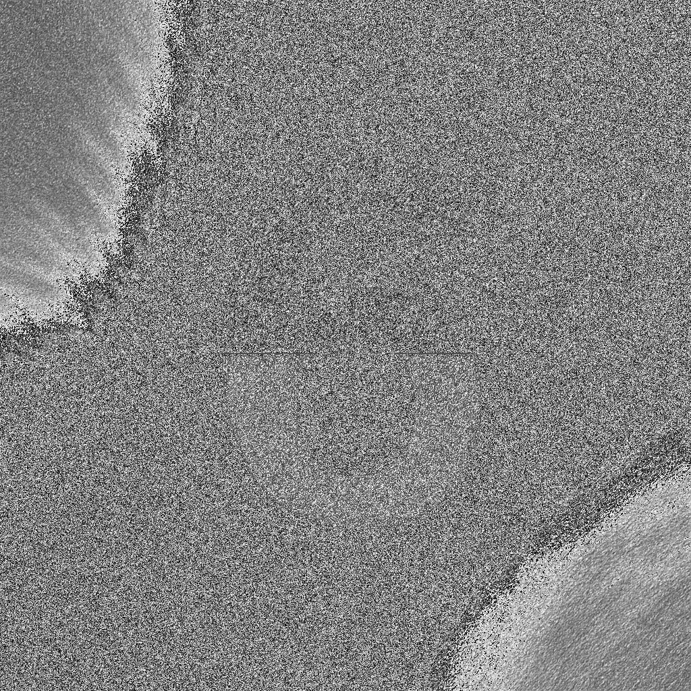
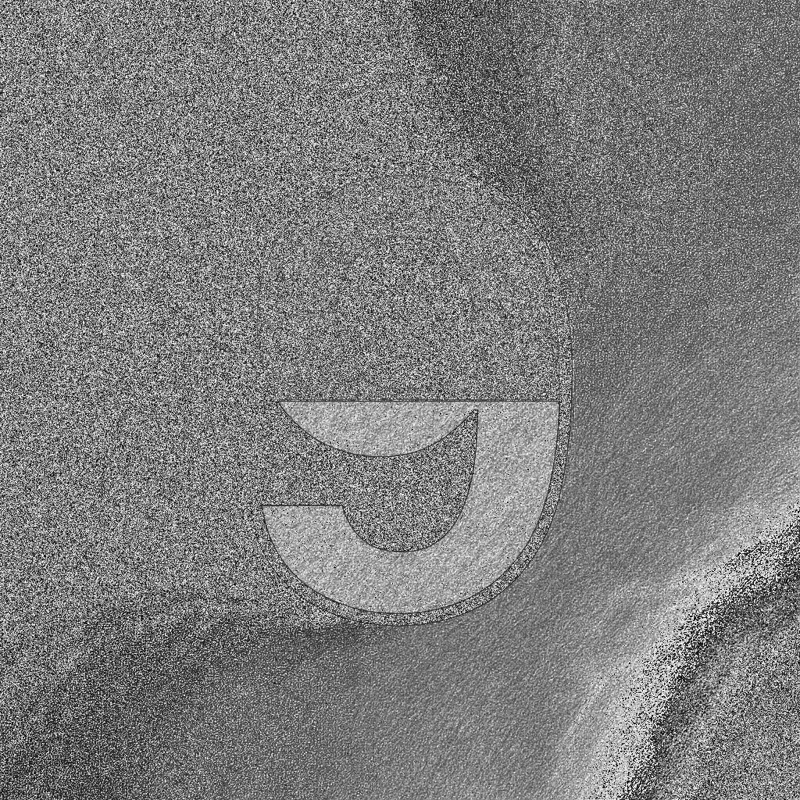
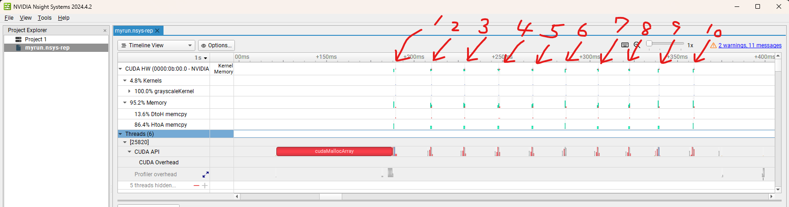
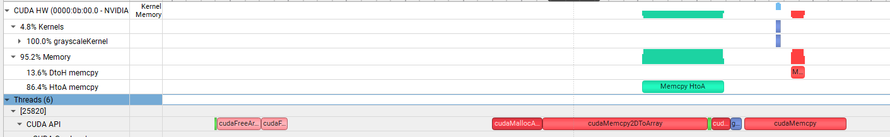

## 目次
- 目的
- Nsightのインストール
- 画像の用意
- OpenCVによる画像のロード
- CUDA Deviceへのデータ転送
- 2D画像の処理
- Nsightの処理の
- 学んだこと

---

## 目的
この記事の目的は、C++出の画像のロード、その画像のCUDAデバイスへの転送、処理、そしてCPUに書き戻して画像を保存するという一連の処理を実現することです。

<p align="center">
  
  
  <br>
  
  
  <br>
  <i>今回の目標。カラー画像をCUDA Kernelでグレースケールに変換</i>
</p>

---

## Nsightのインストール
通常のデバッガでは、GPU側の処理のプロファイルを取るのは難しいです。そこで、今回はNsightを使用して、CUDAが正しく動いているかを視覚的に確認します。

Nsightは、Nvidia Driverを更新していると、自動でインストールされていることが多いです。試しにWindowsのスタートメニューで「Nsight」と入力すると、Nsight Systemと表示されます。


---

## 画像の用意
今回の実験で選択する画像はなんでも問題ありませんが、せっかくAIを使える時代なので、ChatGPTに作ってもらいました。画像生成AIは1, 2年前の時点ではテキストをエンコードし、latent空間から段階的に画像を生成していくような工程で実現されていましたが、Transformerの登場以降、性能の方向性が変化しました。ChatGPTのDALL-E3はTransformer系の技術を使用しており、人間が指定した指示を忠実に画面に反映する能力に優れます。今回、「極彩色の背景をもち、中央に数字が描かれている正方形の画像を10マイ用意せよ」という指示を出したところ、以下のような画像が生成されました。

<p align="center">
  
  
  
  
  <br>
  
  
  
  
  <br>
  <i>ChatGPT DALL-E3で生成した画像。</i>
</p>

私はStableDiffusionのユーザとして1年以上の経験がありますが、画像生成においてこの安定性が実現されていることは驚くべきことです。特に、中央に数字を表示するという指示のみで、ここまで一貫したデザインの、崩れがない、数字として自然な形状が描画されることは簡単に値します。今回の実験とは関係のない点でしたが、非常に驚いた点でした。

## OpenCVによる画像のロード
今回は、CUDAに画像を転送するのが目的であるため、画像の入力、出力については外部のライブラリに頼りました。
OpenCVを使うという検索をすると、OpenCVをソースコードからビルドする記事が良くヒットしますが、そこまでやる必要はありません。近年はOpenCVのページも充実しており、バイナリをインストールすだけであれば、PytorchのサイトのようにわかりやすいUIでインストーラを取得できます。


インストーラを取得した後は、展開し、必要な場所に配置してパスを通し、ビルド時の隣家の設定をすれば、あとはビルド時に自動で動作してくれます。私の場合は *Visual Studio Code* を使用しているため、configurationに以下のような情報を追加しました。

``` 
configure
"${workspaceFolder}/samples/thirdparty/opencv4-11-0/build/include",
"${workspaceFolder}/samples/thirdparty/opencv4-11-0/build/include/opencv2",

args
"-L", "${workspaceFolder}/samples/thirdparty/opencv4-11-0/build/x64/vc16/lib",
"-lopencv_world4110",
"-I", "${workspaceFolder}/samples/thirdparty/opencv4-11-0/build/include",
"-I", "${workspaceFolder}/samples/thirdparty/opencv4-11-0/build/include/opencv2"
```

画像のロードにはクラスを実装し、実験に使用する各クラスで画像をロードせず、一か所で簡単に扱えるようにしました。

```
class ImageStocker
{
    public:
        ImageStocker(std::string dir, int count)
        {
            for (int i = 1; i <= count; i++)
            {
                std::string imgPath = dir + "/img_" + ZeroPadding(2, i) + ".png";
                std::cout << "Image Path: " << imgPath << std::endl;
                cv::Mat img = cv::imread(imgPath);
                if (img.empty()) {
                    printf("failed to load image\n");
                    break;
                }
                m_images.push_back(img);
            }
        } 
        int NumImages()
        {
            return m_images.size();
        }
        cv::Mat Get(int id)
        {
            if (NumImages() <= id)
            {
                std::cout << "m_images.size() <= id" << std::endl;
                return cv::Mat();
            }
            return m_images[id];
        }
    private: 
        std::vector<cv::Mat> m_images;
};
```

## CUDA Deviceへのデータ転送
お待たせしました！ この節が最も重要なパートです。
今回の実験では、DRAM上に展開したcv::Map画像を、GPUに転送します。
実装を始めた時点では、 `cudaMemcpy` のように使いやすく簡単なAPIが用意されていると思っていましたが、違いました。

2D画像の転送にはストライドやwidth, height, depth など、いわゆる画像のshape情報を登録する必要があり、扱いがかなり大変でした。

一枚の画像をカーネルに送るまでに、これだけの処理が必要でした。もっとたくさんの知識をつけて最適化を進めれば読みやすくなると思いますが、それは今後の課題です。
```
// Set Image
cv::Mat imageBGRA;
cv::cvtColor(stocker.Get(i), imageBGRA, cv::COLOR_BGR2BGRA);
cudaChannelFormatDesc channelDesc = cudaCreateChannelDesc<uchar4>();
cudaArray* cuArray;
cudaMallocArray(&cuArray, &channelDesc, imageBGRA.cols, imageBGRA.rows); // cudaMallocArray needs image information (like ndarray to Unity Texture2D, row/col/depth info)
cudaMemcpy2DToArray(cuArray, 0, 0, // Memcpy to cache. It looks like BufferObject in OpenGL 
    imageBGRA.ptr<uchar4>(), imageBGRA.step,
    imageBGRA.cols * sizeof(uchar4), imageBGRA.rows,
    cudaMemcpyHostToDevice);

// Setting Descs
cudaResourceDesc resDesc = {};
resDesc.resType = cudaResourceTypeArray;
resDesc.res.array.array = cuArray;
cudaTextureDesc texDesc = {};
texDesc.addressMode[0] = cudaAddressModeClamp;
texDesc.addressMode[1] = cudaAddressModeClamp;
texDesc.filterMode = cudaFilterModePoint;
texDesc.readMode = cudaReadModeElementType;
texDesc.normalizedCoords = 0;

// Texture Object
cudaTextureObject_t texObj = 0;
cudaCreateTextureObject(&texObj, &resDesc, &texDesc, nullptr);

// Device Memory
int width = imageBGRA.cols;
int height = imageBGRA.rows;
unsigned char* d_output;
cudaMalloc(&d_output, width * height * sizeof(unsigned char));

// Prepare for kernel calling
dim3 block(16, 16);
dim3 grid((width + 15) / 16, (height + 15) / 16);
grayscaleKernel<<<grid, block>>>(texObj, d_output, width, height);
```

特に、Texture Objectの扱いが古い方法と新しい方法で違っている点が重要でした。
古い方法ではグローバル空間にTexture<>を宣言する必要があり、驚く実装でした。
このコードで使用している新しい方法は、引数としてTexture Objectを遅れるため、見通しの良いコード実装が可能になります。

---

## 2D画像の処理
GPUに画像を送信した後、実際の画像処理は以下のカーネルで行いました。

```
__global__ void grayscaleKernel(cudaTextureObject_t texObj, unsigned char* out, int width, int height) // New API can take texObj directly!!!
{
    // this is 2D then blockIdx also 2D.
    int x = blockIdx.x * blockDim.x + threadIdx.x;
    int y = blockIdx.y * blockDim.y + threadIdx.y;
    if (x >= width || y >= height) return;
    uchar4 pixel = tex2D<uchar4>(texObj, x, y);
    unsigned char gray = (pixel.x * pixel.y + pixel.z) / 3;
    out[y * width + x] = gray;
}
```

しかし、残念ながら今回の実験で出力された結果は、以下のようになりました。

<p align="center">
  
  
  
  
  <br>
  
  
  
  
  <br>
  <i>Kernelで処理した画像。</i>
</p>

何かがおかしいですね🤔   

数字が読み取れるということは、画像の構造が大きく壊れたわけではないことが予想されます。一方で、一部の色が非常に見づらくなっていることから、BGR/RGB等のビット数の処理に間違いがあるか、チャンネルやメモリアロケーションの対応が不十分だと思われます。

別の記事で、なぜこれがおかしくなったのかを検証します。

## プロファイル結果
今回はNsightを導入したので、実際にどのような結果になったのかを添付します。



拡大すると、どこでHtoD, DtoHが発生しているのか、何の処理が一番時間を使っているのかを詳細に確認できます。自分が実行したCUDA処理が視覚的に確認できるというのは感動しますね！



CUDA mallocが動作した後、10枚の画像それぞれについてCUDAの処理が動いていることがわかります。今後の記事で、これをパイプライン化（異なるstreamに割り当て）すると動作がどう変わるのかを検証します。

---

## 学んだこと
- Nsightのインストール、使い方
- OpenCVの簡単な導入方法
- OpenCVを用いた効率的な画像のロード
- OpenCV::MatをCUDAと連携させる方法