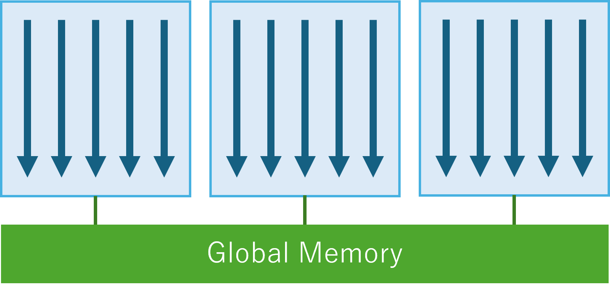
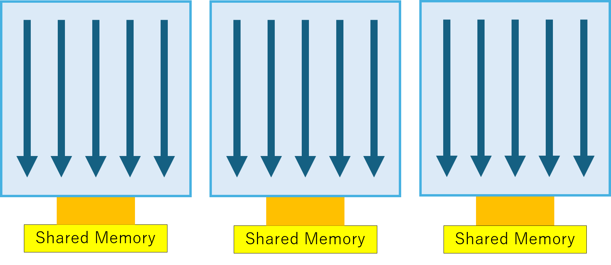
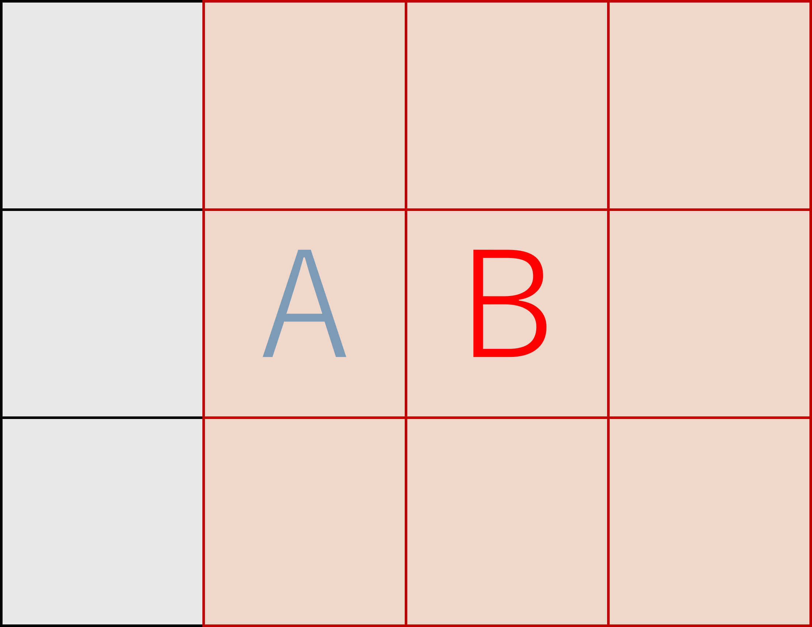

# 目次

- [Sharedメモリとglobalメモリの違い](#Sharedメモリとglobalメモリの違い)
- [一般的な用途](#一般的な用途)
- [比較検討方法の説明](#比較検討方法の説明)
- [使用するプログラム](#使用するプログラム)
- [実行環境](#実行環境)
- [結果](#結果)
- [確認できたこと](#確認できたこと)
- [ちなみに失敗した場合の結果](#ちなみに失敗した場合の結果)
- [知見](#知見)
- [結論](#結論)

---

この記事ではまず役割の違う二つのメモリを紹介します。
続いて、実際に比較検証を行うプログラムを書き、速度を比較します。
今回の実験は一回失敗したので、何が起きたのかを解説します。

## Sharedメモリとglobalメモリの違い

CUDAには複数のメモリ階層が存在します。その中でも、**Shared Memory** はブロック内のスレッドが共同で使える高速なローカルメモリ、**global Memory** はすべてのスレッドがアクセス可能なメモリです。

- **Shared Memory**: 低レイテンシ、カーネル実行ごとにリセットされる。容量は少ない。
- **global Memory**: 高レイテンシ、大容量。GPU全体からアクセス可能。

下図は各メモリの構成イメージです。

<div class="image-row">
    
    
</div>

## 一般的な用途

Shared Memoryは、局所的なデータに繰り返しアクセスするアルゴリズムに向いています。
一般的には、以下のような用途で使うと、大きな高速化の効果が得られます。

- フィルタリング・畳み込み：画像のぼかしや、エッジ検出などの処理。
- ソート（block内）：ブロック内で高速にデータの読み書きが可能なため、中間結果を高速に共有できます。

特に**コンピュータビジョン**分野では、画像フィルタ処理での使用が顕著です。

## 比較検討方法の説明

Shared Memoryは、局所的なデータへのアクセスを高速にする用途で使えます。
コンピュータビジョンの領域では、フィルタリングのような問題がこれにあたります。

例えば、ぼかしの処理を画像に適用する場合、あるピクセルの色を決定するためには、近傍ピクセルの色を取得します。
計算方法は様々なものがありますが、基本的な方法では周辺の値を参照して、何かの計算を適用して、一つの値を求めます。


簡単な図で考えてみましょう。まず上の図のような画像があり、これのフィルタリングをすると考えます。


3x3のフィルタを適用すると考えた場合、Aの値を計算するために参照する範囲は図のようになります。


そして、Bの値を計算するために必要な範囲はこのようになります。


この時、あるピクセルとその隣のピクセルは、重なった部分（緑の領域）では同じ値を参照します。

このように、特定の計算では複数のスレッドが、隣接した情報を何度も参照する場合があります。
個々の処理時間はわずかなものですが、これは画像のサイズや参照する領域のサイズに従って、指数関数的に増加します。

4Kであれば 3840x2160 = 8,294,400この値を計算する必要があり、そのために必要な周辺ピクセルへのアクセスを考えると、どれだけ一回のアクセスが短くとも、
小さな遅延は全体の計算時間に影響を与えます。

今回の実験では、この計算時間の違いを確認するため、Shared Memoryを使用した場合と、Global Memoryのみを使用した場合を比較します。

## 使用するプログラム

使用したコードは以下で公開しています（GitHubなどへのリンクを後で挿入）。

[GitHub](https://github.com/yaikeda/cuda-examples/blob/main/samples/007_SharedMemory/SharedMemory.cu)

C++ (and CUDA C++) で以下を行います：
- 疑似的な画像の生成（ランダムfloat配列を作る）
- CUDAメモリ確保（Global）
- CUDAカーネルの呼び出し
- CUDAカーネル内でのShared Memory確保
- 実行時間の計測（複数回繰り返して計測精度を上げる）

## 実行環境

| 項目 | 値 |
|------|----|
| CPU | AMD Ryzen 3700X |
| GPU | NVIDIA RTX 3060 |
| CUDA Toolkit | 12.9 |
| NVIDIA Driver | 576.02 |
| OS | Windows 11 |
| Compiler | cl.exe (MSVC) |

## 結果

以下は、1,000回処理を繰り返した平均実行時間です：
実行は手元での処理を複数回繰り返し、初回実行時のGlobal Memoryの速度低下がなくなったあとの結果です。

``` 
Filter = 3x3
[global] REPEAT 1000 FILTER 3 Time : 72.1703 ms
[Shared] REPEAT 1000 FILTER 3 Time : 27.0231 ms
```
* **Shared Memoryを適切に使うことで、2~3倍の高速化**が確認されました。

```
Filter = 5x5
[global] REPEAT 1000 FILTER 5 Time : 170.285 ms
[Shared] REPEAT 1000 FILTER 5 Time : 37.7198 ms
```

```
Filter = 7x7
[global] REPEAT 1000 FILTER 7 Time : 291.37 ms
[Shared] REPEAT 1000 FILTER 7 Time : 53.5055 ms
```
* **フィルタサイズを大きくすると顕著に速度差が広がること**が確認されました。

## 確認できたこと

- Shared Memoryによる近傍アクセスのキャッシュが有効に働く
- スレッドごとの重複アクセスを削減できる
- フィルタサイズが大きくなるほど差が広がる傾向がある

## ちなみに失敗した場合の結果

以下のようなケースでは逆に**遅くなる**可能性があります：

- Shared Memoryに**無駄に多くのデータをコピー**している
- 各スレッドが同じglobal Memoryを繰り返し読む（コピーの恩恵が薄い）
- スレッド間の同期が多くなり過ぎる

例：9画素ずつコピーしていた場合、結局global Memoryアクセスが減らず、**コピーコスト分だけ損をする**ケースもありました。

今回のプログラムでも、最初のバージョンでは実装を間違えており、Shared Memoryに対して1スレッドにつき9回のGlobal Memoryアクセスを実行していました。
このため処理速度は上がらず、Global Memory版よりも遅い結果となっていました。
実験に使用している修正版では、すべてのスレッドが1つのデータだけコピーしており、並列コピーが達成されています。

## 知見

- Shared Memoryのコピーも**スレッド並列性を活かす**
- **冗長なGlobal Memoryアクセスを避ける設計**が重要
- **同期（`__syncthreads()`）の入れどころにも注意**

## 結論

- Shared Memoryは**カーネルごとに初期化される高速な一時記憶**
- **同じデータを複数スレッドが参照する場面**で効果を発揮
- ただし**使い方を誤ると逆効果**になる
- 最適なアクセスパターン設計が求められる

---

## Reference
- [NVIDIA CUDA C Programming Guide](https://docs.nvidia.com/cuda/cuda-c-programming-guide/index.html)
